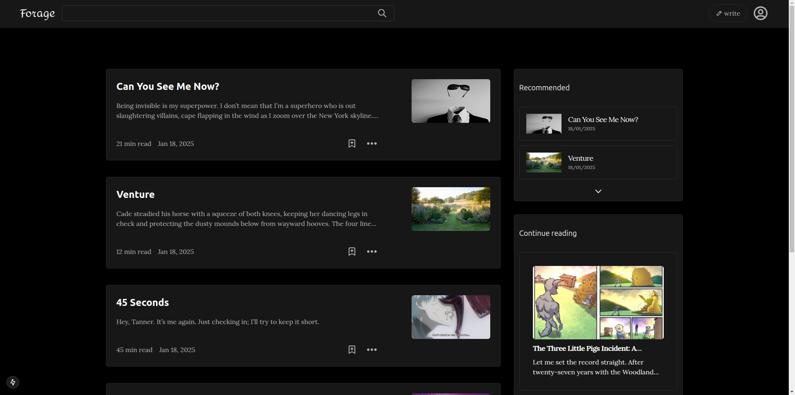
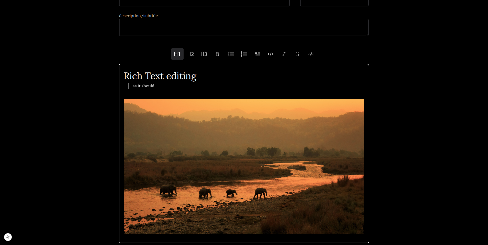
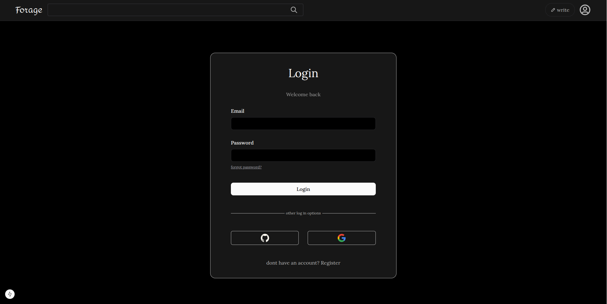

This is a [Next.js](https://nextjs.org) project bootstrapped with [`create-next-app`](https://nextjs.org/docs/app/api-reference/cli/create-next-app).

## Getting Started

First, run the development server:

```bash
npm run dev
# or
yarn dev
# or
pnpm dev
# or
bun dev
```

## home page

Home page is inspired by medium, and is responsive on all devices


## rich text feature

a blazingly fast rich text editor implemented using tiptap, and aws s3 to host images


## User Authentication

secure user login and registration, following industry best practices.


Open [http://localhost:3000](http://localhost:3000) with your browser to see the result.

# documentation for custom components:

# MenuBar Component

`MenuBar` is a reusable and dynamic navigation menu component for React applications. It highlights the active tab with an animated underline and supports callbacks for tab changes.

---

## location

/src/app/reusable-ui

## Installation

Ensure you have React and Tailwind CSS set up in your project.

```bash
npm install clsx
```

---

## Props

### `items`

- **Type**: `NonEmptyArray<string>`
- **Required**: Yes
- **Description**: An array of menu items to display.
- **Example**:
  ```tsx
  items={["Home", "About", "Contact"]}
  ```

### `defaultItem`

- **Type**: `string | undefined`
- **Required**: No
- **Description**: The default active tab. Defaults to the first item in the `items` array if not provided.
- **Example**:
  ```tsx
  defaultItem = "About";
  ```

### `onTabChange`

- **Type**: `(activeTab: string) => void`
- **Required**: No
- **Description**: A callback triggered whenever the active tab changes.
- **Example**:
  ```tsx
  onTabChange={(activeTab) => console.log(activeTab)}
  ```

---

## Usage

### Basic Example

```tsx
import MenuBar from "./MenuBar";

const App = () => {
  const handleTabChange = (tab: string) => {
    console.log("Active tab:", tab);
  };

  return (
    <MenuBar
      items={["Home", "About", "Contact"]}
      defaultItem="About"
      onTabChange={handleTabChange}
    />
  );
};

export default App;
```

### Dynamic Content Rendering

```tsx
import { useState } from "react";
import MenuBar from "./MenuBar";

const App = () => {
  const [activeTab, setActiveTab] = useState<string>("Home");

  return (
    <div>
      <MenuBar
        items={["Home", "About", "Contact"]}
        defaultItem="Home"
        onTabChange={setActiveTab}
      />

      {activeTab === "Home" && <p>Welcome to the Home page!</p>}
      {activeTab === "About" && <p>Learn more about us on the About page.</p>}
      {activeTab === "Contact" && <p>Contact us through this page.</p>}
    </div>
  );
};

export default App;
```

---

## Features

1. **Error Validation**:

   - Ensures `items` is non-empty.
   - Validates that `defaultItem` exists in `items`.

2. **Dynamic Active State**:

   - Tracks the active tab with the `isActive` state.

3. **Smooth Animation**:

   - Highlights the active tab with an animated underline.

4. **Callback Support**:

   - Triggers `onTabChange` for external state updates.

---

## Styling

`MenuBar` uses Tailwind CSS for styling. Ensure these utility classes are defined:

```css
.text-item-foreground {
  color: gray;
}
.text-white {
  color: white;
}
.bg-white {
  background-color: white;
}
.bg-item {
  background-color: lightgray;
}
```

---

## Accessibility

- Please add ARIA attributes for better screen reader support.

---

## License

This component is open-source and available under the MIT License.
